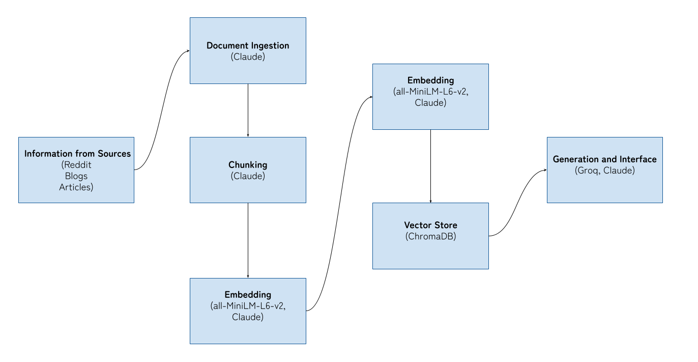

# Project 1 Planning: The Unofficial Guide

> Write this document before you write any pipeline code.
> Your spec and architecture diagram are what you'll use to direct AI tools (Claude, Copilot, etc.) to generate your implementation — the more specific they are, the more useful the generated code will be.
> Update the Retrieval Approach and Chunking Strategy sections if you change your approach during implementation.
> Update this file before starting any stretch features.

---

## Domain

My domain is solo female travel experiences. This unofficial guide will provide general information, spanning what it’s like to travel at different ages as a woman, the pros and cons of solo travel, and packing and safety advice. This knowledge is hard to find because it’s spread across diverse sources. It’s time-consuming to go through each source, and there’s a high likelihood you'll miss key information while searching for what you need about solo female travel experiences. 

---

## Documents

<!-- List your specific sources: URLs, subreddit names, forum threads, or file descriptions.
     Aim for at least 10 sources that together cover different subtopics or perspectives within your domain. -->

| # | Source | Description | URL or location |
|---|--------|-------------|-----------------|
| 1 | r/AskOldPeople | A thread of women solo travel experiences in their youth | [Link](https://www.reddit.com/r/AskOldPeople/comments/1klq25w/women_who_solo_travelled_in_their_youth_what_was/) |
| 2 | r/travel | Solo trip tips for girls | [Link](https://www.reddit.com/r/travel/comments/jswvex/solo_trip_tips_for_a_girl/) |
| 3 | r/travel | Whether or not solo traveling is safe for women | [Link](https://www.reddit.com/r/travel/comments/1sfuuek/solo_traveling_as_a_woman_is_it_actually_safe_or/) |
| 4 | r/TheGirlSurvivalGuide | Advice from women who've gone on solo trips | [Link](https://www.reddit.com/r/TheGirlSurvivalGuide/comments/18z2m9c/women_whove_gone_on_solo_trips_how_do_you_do_it/) |
| 5 | r/solotravel | Safety precautions and advice for girls in twenties | [Link](https://www.reddit.com/r/solotravel/comments/b6t9z8/what_adviceprecautions_can_you_give_to_a_girl_in/) |
| 6 | r/solofemaletravellers | Solo female travel experiences | [Link](https://www.reddit.com/r/solofemaletravellers/comments/1qyhrv7/hi_ladies_please_share_your_first_solo_travel/) |
| 7 | r/NeedTravelAdvice | Safest countries for women traveling solo | [Link](https://www.reddit.com/r/NeedTravelAdvice/comments/1rzpsaj/safest_countries_for_women_traveling_solo/) |
| 8 | r/TooAfraidToAsk | Places for first time solo trip for women | [Link](https://www.reddit.com/r/TooAfraidToAsk/comments/x9wze7/women_of_reddit_which_countrycity_would_you/) |
| 9 | r/solotravel | Safety reminders for young female solo travelers | [Link](https://www.reddit.com/r/solotravel/comments/176xzs0/an_unfortunate_reminder_for_other_young_female/) |
| 10 | Road Scholar | Solo Travel Guide for Women | [Link](https://www.roadscholar.org/travel-tips/solo-female-travel-for-women/) |
| 11 | r/solofemaletravellers | Safe and unsafe places to solo travel as a woman | [Link](https://www.reddit.com/r/solofemaletravellers/comments/1otb107/where_did_you_feel_surprisingly_safe_or_unsafe_as/) |
| 12 | r/TwoXChromosomes | How to feel safe during traveling | [Link](https://www.reddit.com/r/TwoXChromosomes/comments/1da7j9w/how_do_you_solo_female_travelers_manage_to_feel/) |
| 13 | r/solotravel | Suggestions for a senior woman looking to solo travel | [Link](https://www.reddit.com/r/solotravel/comments/1bx1mfz/solo_travel_as_a_senior_woman/) |
| 14 | r/travel | Whether solo traveling as a woman is dangerous or not | [Link](https://www.reddit.com/r/travel/comments/19ar3r6/is_solo_traveling_as_a_woman_as_dangerous_as_its/) |
| 15 | r/solotravel | Advice on getting over fear mongering | [Link](https://www.reddit.com/r/solotravel/comments/12b3gff/solo_female_travelers_how_do_you_get_over_the/) |
| 16 | r/AskWomen | Reasons to go solo traveling as a woman and experiences | [Link](https://www.reddit.com/r/AskWomen/comments/ax57cz/solo_traveling_ladies_of_reddit_how_did_you_come/) |
| 17 | r/travel | Advice for women solo traveling for the first time | [Link](https://www.reddit.com/r/travel/comments/x6xx4c/the_advice_i_needed_3_years_ago_when_i_started/) |
| 18 | r/solotravel | Hacks and tips to solo travel | [Link](https://www.reddit.com/r/solotravel/comments/fc9vd7/i_consolidated_all_of_rsolotravels_little_hacks/) |
| 19 | Solo Traveler | Reasons, advice, and trip ideas for aspiring solo female travelers | [Link](https://solotravelerworld.com/category/how-to-travel-alone/solo-female-travel/) |
| 20 | EatWanderExplore | Advice for solo female and LGBTQ traveling | [Link](https://eatwanderexplore.com/start-traveling-blog/is-it-safe-for-women-or-lgbtq-to-travel-around-the-world-plus-expert-travel-advice) |
| 21 | Blond Wayfarer | Solo Female Travel Guide for Beginners | [Link](https://blondwayfarer.com/beginners-guide-solo-female-travel/) |
| 22 | BucketListly Blog | Experience traveling solo as an Asian female traveler | [Link](https://www.bucketlistly.blog/posts/solo-female-traveler-gone-goat-interview) |
| 23 | r/AskWomenOver60 | Perspectives on feeling vulnerable solo traveling as one gets older | [Link](https://www.reddit.com/r/AskWomenOver60/comments/1fdunkm/if_you_travel_solo_do_you_feel_more_vulnerable_as/) |
| 24 | The Good Life Abroad | Solo Travel Tips for Senior Women | [Link](https://thegoodlifeabroad.com/senior-women-travel/auto-draft) |
| 25 | Women on the Road | The Highs and Lows of Older Women Solo Travel | [Link](https://www.women-on-the-road.com/solo-travel.html) |
| 26 | The Catalyst | Benefits and Pitfalls of Solo Female Travel | [Link](https://thecatalystnews.com/2025/10/24/the-benefits-and-pitfalls-of-solo-female-travel/) |
| 27 | r/solotravel | Negative experiences of solo travel | [Link](https://www.reddit.com/r/solotravel/comments/d9ripx/its_okay_to_discuss_the_negatives_of_solo_travel/) |
| 28 | Where Goes Rose? | Pros and Cons of Solo Female Travel | [Link](https://www.wheregoesrose.com/pros-cons-solo-travel/) |
| 29 | r/solotravel | Dangerous experience as a solo woman traveler | [Link](https://www.reddit.com/r/solotravel/comments/171ihf6/attention_solo_women_travellers_please_read_this/) |
| 30 | r/solotravel | Experiences and advice traveling in Italy as a Black woman | [Link](https://www.reddit.com/r/solotravel/comments/k166cm/experiences_of_black_women_traveling_solo_in_italy/) |
| 31 | r/blackladies | Advice from Black women travelers | [Link](https://www.reddit.com/r/blackladies/comments/11f7m8z/honest_advice_from_black_girls_who_like_to_travel/) |
| 32 | r/blackladies | How to enjoy traveling while handling potential discrimination abroad | [Link](https://www.reddit.com/r/blackladies/comments/xonkxj/international_solo_travel_how_do_you_enjoy_travel/) |
| 33 | r/solotravel | Solo traveling concerns from an Asian woman | [Link](https://www.reddit.com/r/solotravel/comments/6dluxu/solo_travelling_concerns_asian_female/) |
| 34 | Adventures with Carli | Safety tips for solo travelers | [Link](https://adventureswithcarli.com/resources/solo-travel/safety-tips-for-solo-travelers/) |
| 35 | Essence | The Black girl's guide to traveling internationally | [Link](https://www.essence.com/lifestyle/travel/solo-travel-tips-for-beginners/) |

---

## Chunking Strategy

Since I have diverse sources, I plan to split each source type differently. 

| Source | Chunk Size | Overlap Size |
|--------|------------|--------------|
| Reddit | 400 Characters | 50 Chars |
| Blogs | 1000 Characters | 100 Chars|
| Articles | 1000 Characters | 100 Chars |

**Reasoning:**
Reddit: Reddit posts and comments are of shorter length generally. 
Articles and Blogs: Both forms of sources are longer and narrative like, and organized by topic. 

I'm planning to mainly implement recursive chunking to split text. Reddit posts aren't uniformly sized and tend to have noisy unstructured text. Recursive chunking also can be used for articles and blogs since they may not have consistent formattings.

Finalized:
| Source | Chunk Size | Overlap Size |
|--------|------------|--------------|
| Reddit | 400 Characters | 50 Chars |
| Blogs | 550 Characters | 100 Chars|
| Articles | 500 Characters | 100 Chars |

After implementing chunk.py, I realized the chunks for blogs and articles are too lengthy and involved noisy/irrelevant information. So I cut it short around 500-550 for blogs and articles. 

---

## Retrieval Approach

**Embedding model:** all-MiniLM-L6-v2 via sentence transformers

**Top-k:** 4; Because my sources vary in quality, 4 chunks seem sufficient to provide a completed answer without so much noise

**Production tradeoff reflection:**
I would weigh in context length and latency when it comes to choosing a different embedding model. 

---

## Evaluation Plan

<!-- List your 5 test questions with their expected correct answers.
     Questions should be specific enough that you can judge whether the system's response
     is right or wrong. "What are good dining halls?" is too vague.
     "What do students say about wait times at [dining hall name] during lunch?" is testable. -->

| # | Question | Expected answer |
|---|----------|-----------------|
| 1 | What are people's opinions about staying in hostels as a solo female traveler? | People say staying in hostels feel safe and gives a sense of community. Plus it is budget friendly |
| 2 | What do people say about the pros of solo travel? | Self-development, empowerment, not waiting for people, complete control, managing own budget
| 3 | What do people say about managing to feel safe during traveling? | Being situationally aware, looking confident, and do your research |
| 4 | Why do people worry about traveling alone as a woman? | Safety Issues|
| 5 | How should one pack for a solo trip? | Pack lightly and stick to essentials|

---

## Anticipated Challenges

1. Noisy documents since reddit posts are noisy in general; some comments range from your average 5 words "I'm sorry to hear that" to paragraphs of rants. 

2. Chunks that split key information across boundaries because there's a possibility that the chunking for reddit posts don't go well given text lengths vary erratically. 

---

## Architecture

---

## AI Tool Plan
     
All parts of the pipeline will be assisted by Claude
     
1. Document Ingestion: Claude will assist me in constructing a script to collect and process the sources as indicated in this document. I plan to share my documents section.
2. Chunking: I will use Claude to implement chunk_text() with my chunking strategy section, specified chunk size and overlap. 
3. Embedding and Retrieval: I'll give Claude my retrieval approach and pipeline diagram to generate embedding and retrieval code. It will help load the chunks, embed it with the all-MiniLM-L6v2, storing in ChromaDB and implementing a retrieval function. 
4. Generation and Interface: I will share my grounding requirements, output format with Claude so it can synthesize it to implement generation and interface. Then I'll connected it with Groq

**Milestone 3 — Ingestion and chunking:**

**Milestone 4 — Embedding and retrieval:**

**Milestone 5 — Generation and interface:**
Test Runs:
Q1: Accurate
Q2: Accurate
Q3: Accurate
Q4: Accurate
Q5: Accurate

Failure Case: The output to one question: "Should I go to Egypt" resulted in improper capitalization when quoting. This is likely due to improper cleaning of text. 